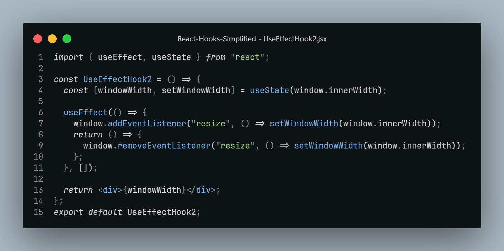

# React Hooks simplified

## Must know hooks

1. [useState](#usestate)
2. [useEffect](#useEffect)
3. [useContext](#useContext)

## Lesser used hooks

4. [useRef](#useRef)
5. [useMemo](#useMemo)
6. [useCallback](#useCallback)
7. [useReducer](#useReducer)
8. [useTransition](#useTransition)
9. [useDeferredValue](#useDeferredValue)

## Optional hooks

10. [useLayoutEffect](#useLayoutEffect)
11. [useDebugValue](#useDebugValue)
12. [useImperativeHandle](#useImperativeHandle)
13. [useId](#useId)

## Custom hooks

14. How to create [Custom hooks](#custom-hooks)?
15. Custom hooks #1-5:
    1. [useToggle](#useToggle)
    2. [useTimeout](#useTimeout)
    3. [useDebounce](#useDebounce)
    4. [useUpdateEffect](#useUpdateEffect)
    5. [useArray](#useArray)
16. Custom hooks #6-10:
    1.  [usePrevious](#usePrevious)
    2.  [useStateWithHistory](#useStateWithHistory)
    3.  [useStorage](#useStorage)
    4.  [useAsync](#useAsync)
    5.  [useFetch](#useFetch)
17. Custom hooks #11-15:
    1. [useScript](#useScript)
    2. [useDeepCompareEffect](#useDeepCompareEffect)
    3. [useEventListener](#useEventListener)
    4. [useOnScreen](#useOnScreen)
    5. [useWindowSize](#useWindowSize)
18. Custom hooks #16-20:
    1. [useMediaQuery](#useMediaQuery)
    2. [useGeolocation](#useGeolocation)
    3. [useStateWithValidation](#useStateWithValidation)
    4. [useSize](#useSize)
    5. [useEffectOnce](#useEffectOnce)
19. Custom hooks #21-25:
    1. [useClickOutside](#useClickOutside)
    2. [useDarkMode](#useDarkMode)
    3. [useCopyToClipboard](#useCopyToClipboard)
    4. [useCookie](#useCookie)
    5. [useTranslation](#useTranslation)
20. Custom hooks #26-30:
    1. [useOnlineStatus](#useOnlineStatus)
    2. [useRenderCount](#useRenderCount)
    3. [useDebugInformation](#useDebugInformation)
    4. [useHover](#useHover)
    5. [useLongPress](#useLongPress)

## Experimental hooks

21. [useEffectEvent](#useEffectEvent)
22. [use](#use)
23. [useActionState](#useActionState)
24. [useOptimistic](#useOptimistic)

---

## Key Points: (Gotcha's)

- Can only use Hooks inside a function
- Should be declared at top most
- Should be executed in same order as declared
- So cannot use inside condition blocks

### useState

- It returns two values
  - State
  - Setter function - updates the current state
- Always use function version to update state with prev value passed in
- initial state value declared inside the useState function call as argument
- other way to set initial state
  - function version to declare initial state
- When an Object is declared as initial state
  - whenever state is modified always spread prev values to the setState function
  - bcoz of mutability

### useEffect

- when side effects are needed
- one action depends on other like fetching data, changes based on event listeners
- useEffect cleanup !important
  - just return a function that removes the event listener.
    

### useContext

-
